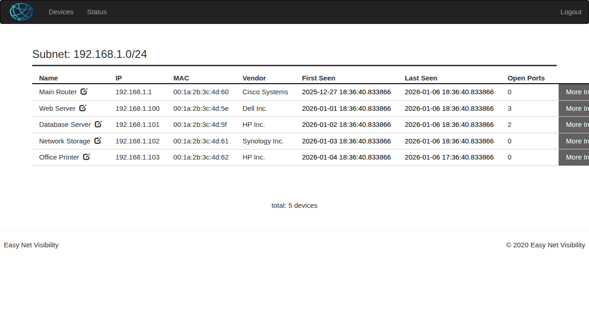
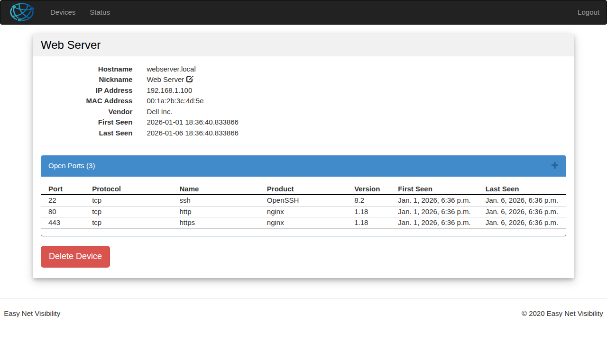
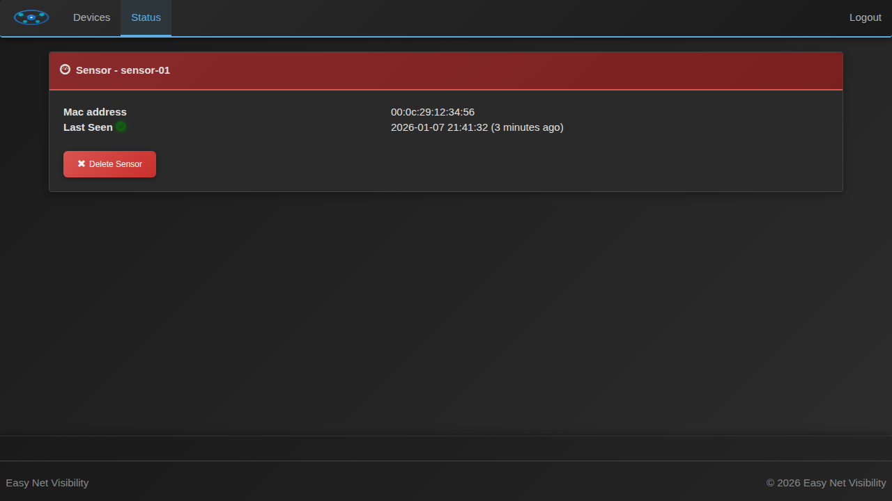

# Easy Net Visibility

**Network scanning agent and dashboard for complete visibility of all services running on your network**

[](LICENSE)

## Documentation

- **[README.md](README.md)** - Overview, installation, and quick start (this file)
- **[ARCHITECTURE.md](ARCHITECTURE.md)** - System architecture and design details
- **[API.md](API.md)** - Complete API reference with examples
- **[CONTRIBUTING.md](CONTRIBUTING.md)** - Contribution guidelines for developers
- **[PUSHOVER.md](PUSHOVER.md)** - Pushover notification integration guide

## Table of Contents

- [Overview](#overview)
- [Screenshots](#screenshots)
- [Features](#features)
- [Architecture](#architecture)
- [Quick Start](#quick-start)
- [Installation](#installation)
  - [Server Installation](#server-installation)
  - [Sensor Installation](#sensor-installation)
- [Configuration](#configuration)
  - [Server Configuration](#server-configuration)
  - [Sensor Configuration](#sensor-configuration)
  - [Fortigate Integration](#fortigate-firewall-integration)
- [Development and Testing](#development-and-testing)
- [Release Process](#release-process)
- [API Documentation](#api-documentation)
- [Troubleshooting](#troubleshooting)
- [Contributing](#contributing)
- [License](#license)

## Overview

Easy Net Visibility provides centralized visibility for all devices on your network. It consists of two main components that work together to discover, monitor, and report on network devices:

1. **Server** - Django-based web application providing a dashboard and API for device management
2. **Sensor** - Network scanning agent that discovers devices and reports to the server

Both components are containerized using Docker for easy deployment and scalability.

### How It Works

- **Sensors** scan your network using `nmap` to discover devices and identify open ports
- **Fortigate Integration** (optional) pulls device information from Fortigate firewalls for enhanced discovery
- **Server** aggregates data from multiple sensors and presents it through a web dashboard
- **Notifications** (optional) send real-time alerts via Pushover for network events

### Project History

This project was originally based on the open-source SweedSecurity project, with significant enhancements:
- Removed IDS (Intrusion Detection System) components to focus on visibility
- Implemented full containerization with Docker
- Rebuilt server on Django framework for better scalability
- Enhanced UI for managing large numbers of devices
- Added Fortigate firewall integration
- Added comprehensive notification system

## Screenshots

### Dashboard - Device List
The main dashboard displays all discovered devices on your network with their IP addresses, MAC addresses, vendors, and open ports.



### Device Details
Click on any device to view detailed information including hostname, network details, and all open ports with service identification.



### Sensor Status
Monitor the health and status of your network sensors to ensure continuous monitoring.



## Features

### Core Capabilities
- **Automated Network Scanning** - Continuous discovery of network devices using nmap
- **Port Scanning** - Identify open ports and running services on each device
- **Multi-Sensor Architecture** - Deploy multiple sensors across different network segments
- **Web Dashboard** - Centralized view of all discovered devices and services
- **Device Management** - Track device hostnames, IP addresses, MAC addresses, and vendors

### Advanced Features
- **Fortigate Firewall Integration** - Enhanced device discovery using FortiGate's Assets API
- **Real-time Notifications** - Pushover integration for instant alerts ([see PUSHOVER.md](PUSHOVER.md))
  - New device detection
  - Gateway/sensor timeout alerts
  - Device offline notifications (for important devices)
- **Historical Tracking** - Monitor when devices were first seen and last seen
- **Flexible Database Support** - Use SQLite (default) or external databases (MySQL, PostgreSQL)
- **RESTful API** - Programmatic access to device data
- **Containerized Deployment** - Easy deployment with Docker

### Supported Platforms
- **Server**: x86-64 Linux (tested on CoreOS/GCP)
- **Sensor**: x86 (Intel/AMD), ARM (Raspberry Pi), various Linux distributions (Raspbian, Yocto)

## Architecture

### System Overview

```
┌─────────────────────────────────────────────────────────────┐
│                         Network                              │
│                                                              │
│  ┌──────────┐  ┌──────────┐  ┌──────────┐  ┌────────────┐ │
│  │ Device 1 │  │ Device 2 │  │ Device 3 │  │ Fortigate  │ │
│  └──────────┘  └──────────┘  └──────────┘  │  Firewall  │ │
│       │             │             │         └────────────┘ │
│       └─────────────┼─────────────┘              │         │
│                     │                             │         │
│              ┌──────▼───────┐            ┌───────▼──────┐  │
│              │  Sensor 1    │            │  Sensor 2    │  │
│              │ (nmap scan)  │            │ (Fortigate)  │  │
│              └──────┬───────┘            └───────┬──────┘  │
│                     │                             │         │
└─────────────────────┼─────────────────────────────┼─────────┘
                      │                             │
                      │     HTTPS/REST API          │
                      └─────────────┬───────────────┘
                                    │
                         ┌──────────▼──────────┐
                         │   Django Server     │
                         │   - Web Dashboard   │
                         │   - REST API        │
                         │   - Database        │
                         └──────────┬──────────┘
                                    │
                         ┌──────────▼──────────┐
                         │  Pushover Service   │
                         │  (Notifications)    │
                         └─────────────────────┘
```

### Component Details

#### Server (Django)
- **Web Framework**: Django with REST framework
- **Database**: SQLite (default) or external database (MySQL/PostgreSQL)
- **Web Server**: Gunicorn with optional nginx/Apache reverse proxy
- **Authentication**: HTTP Basic Auth or Django authentication
- **Port**: 8000 (default, can be changed)

#### Sensor (Python)
- **Scanner**: nmap for network discovery and port scanning
- **API Client**: Communicates with server via REST API
- **Configuration**: INI file-based configuration
- **Scheduling**: Continuous scanning with configurable intervals
- **Optional**: Fortigate API integration

#### Data Flow
1. Sensor scans network (nmap) or queries Fortigate
2. Sensor normalizes device data (IP, MAC, hostname, ports)
3. Sensor sends data to server via REST API
4. Server validates and stores data in database
5. Server triggers notifications for configured events
6. Web dashboard displays current and historical data

## Quick Start

### Prerequisites
- Docker installed on your system
- Network access from sensor to target network
- (Optional) Fortigate firewall with API access
- (Optional) Pushover account for notifications

### 1. Deploy the Server

```bash
# Create directories for configuration and database
mkdir -p /opt/easy_net_visibility/conf
mkdir -p /opt/easy_net_visibility/db

# Create settings.json (see Configuration section below)
cat > /opt/easy_net_visibility/conf/settings.json << 'EOF'
{
  "DATABASES": {
    "default": {
      "ENGINE": "django.db.backends.sqlite3",
      "NAME": "db/db.sqlite3"
    }
  },
  "SECRET_KEY": "CHANGE-THIS-TO-A-RANDOM-SECRET-KEY",
  "DEBUG": "False",
  "STATIC_ROOT": "static"
}
EOF

# Pull the Docker image from Docker Hub
docker pull rdxmaster/easy-net-visibility-server-django:latest

# Or build locally from source
# docker build -t rdxmaster/easy-net-visibility-server-django easyNetVisibility/server/server_django/

# Run the server
docker run -d --restart=always \
    -p 8000:8000 \
    --volume="/opt/easy_net_visibility/conf:/opt/app/easy_net_visibility/conf:ro" \
    --volume="/opt/easy_net_visibility/db:/opt/app/easy_net_visibility/db:rw" \
    -e DJANGO_SUPERUSER_USERNAME=admin \
    -e DJANGO_SUPERUSER_PASSWORD=your_secure_password \
    -e DJANGO_SUPERUSER_EMAIL=admin@example.com \
    --name=easy-net-visibility-server \
    rdxmaster/easy-net-visibility-server-django:latest
```

### 2. Deploy the Sensor

```bash
# Create configuration directory
mkdir -p /opt/easynetvisibility

# Create config.ini (see Configuration section below)
cat > /opt/easynetvisibility/config.ini << 'EOF'
[ServerAPI]
serverURL=http://YOUR_SERVER_IP:8000
serverUsername=admin
serverPassword=your_secure_password
validateServerIdentity=False

[General]
interface=eth0
EOF

# Pull the Docker image from Docker Hub
docker pull rdxmaster/easy-net-visibility-sensor:latest

# Or build locally from source
# docker build -t rdxmaster/easy-net-visibility-sensor easyNetVisibility/client/

# Run the sensor
docker run -d --restart=always \
    --name=easy-net-visibility-sensor \
    --net=host \
    -v /opt/easynetvisibility:/opt/sensor/config \
    rdxmaster/easy-net-visibility-sensor:latest
```

### 3. Access the Dashboard

Open your web browser and navigate to:
```
http://YOUR_SERVER_IP:8000
```

Login with the admin credentials you specified during deployment.

### 4. (Optional) Setup HTTPS

For production deployments, it's recommended to use HTTPS. See the [Installation](#installation) section for reverse proxy configuration.

## Installation

### Server Installation

The server component provides the web dashboard and API for managing network device data.

#### Tested Platforms
- **Recommended**: x86-64 Linux (tested on CoreOS on Google Cloud Platform)
- **Instance Size**: Micro instance is sufficient for small to medium networks

#### Pull from Docker Hub (Recommended)

```bash
# Pull the latest server image
docker pull rdxmaster/easy-net-visibility-server-django:latest

# Or pull a specific version
docker pull rdxmaster/easy-net-visibility-server-django:1.0.0
```

#### Build from Source (Optional)

```bash
# Navigate to server directory
cd easyNetVisibility/server/server_django

# Build Docker image
docker build -t rdxmaster/easy-net-visibility-server-django .
```

#### Configuration Setup

1. **Create configuration directory**:
```bash
mkdir -p /opt/easy_net_visibility/conf
mkdir -p /opt/easy_net_visibility/db
```

2. **Create settings.json**:
```bash
cat > /opt/easy_net_visibility/conf/settings.json << 'EOF'
{
  "DATABASES": {
    "default": {
      "ENGINE": "django.db.backends.sqlite3",
      "NAME": "db/db.sqlite3"
    }
  },
  "SECRET_KEY": "GENERATE-A-LONG-RANDOM-SECRET-KEY-HERE",
  "DEBUG": "False",
  "STATIC_ROOT": "static",
  "PUSHOVER_CONFIG": {
    "enabled": false,
    "user_key": "YOUR_PUSHOVER_USER_KEY",
    "api_token": "YOUR_PUSHOVER_API_TOKEN",
    "alert_new_device": false,
    "alert_gateway_timeout": false,
    "alert_device_offline": false,
    "gateway_timeout_minutes": 10
  }
}
EOF
```

**Important**: Generate a strong SECRET_KEY using:
```bash
python -c 'from django.core.management.utils import get_random_secret_key; print(get_random_secret_key())'
```

#### Running the Server

**Production deployment**:
```bash
docker run -d --restart=always \
    -p 8000:8000 \
    --volume="/opt/easy_net_visibility/conf:/opt/app/easy_net_visibility/conf:ro" \
    --volume="/opt/easy_net_visibility/db:/opt/app/easy_net_visibility/db:rw" \
    -e DJANGO_SUPERUSER_USERNAME=admin \
    -e DJANGO_SUPERUSER_PASSWORD=your_secure_password \
    -e DJANGO_SUPERUSER_EMAIL=admin@example.com \
    --name=easy-net-visibility-server \
    rdxmaster/easy-net-visibility-server-django:latest
```

**For testing** (interactive mode):
```bash
docker run -it --rm \
    -p 8000:8000 \
    --volume="/opt/easy_net_visibility/conf:/opt/app/easy_net_visibility/conf:ro" \
    --volume="/opt/easy_net_visibility/db:/opt/app/easy_net_visibility/db:rw" \
    -e DJANGO_SUPERUSER_USERNAME=admin \
    -e DJANGO_SUPERUSER_PASSWORD=test_password \
    -e DJANGO_SUPERUSER_EMAIL=admin@test.com \
    --name=easy-net-visibility-server \
    rdxmaster/easy-net-visibility-server-django:latest
```

#### Using External Database

To use MySQL or PostgreSQL instead of SQLite, update `settings.json`:

**MySQL Example**:
```json
{
  "DATABASES": {
    "default": {
      "ENGINE": "django.db.backends.mysql",
      "NAME": "easy_net_visibility",
      "USER": "dbuser",
      "PASSWORD": "dbpassword",
      "HOST": "mysql-host",
      "PORT": "3306"
    }
  }
}
```

**PostgreSQL Example**:
```json
{
  "DATABASES": {
    "default": {
      "ENGINE": "django.db.backends.postgresql",
      "NAME": "easy_net_visibility",
      "USER": "dbuser",
      "PASSWORD": "dbpassword",
      "HOST": "postgres-host",
      "PORT": "5432"
    }
  }
}
```

#### HTTPS/Reverse Proxy Setup

For production, deploy a reverse proxy (Apache or nginx) in front of the Django server.

**Apache Example** (see `/easyNetVisibility/server/httpd_proxy_conf` directory):

1. **Generate or obtain SSL certificates**:

Self-signed certificates (for testing):
```bash
openssl genrsa -out /opt/httpd/private_key.pem 2048
openssl req -new -key /opt/httpd/private_key.pem -out /opt/httpd/request.csr -batch
openssl x509 -req -in /opt/httpd/request.csr -signkey /opt/httpd/private_key.pem -out /opt/httpd/cert.pem
```

Let's Encrypt certificates (for production):
```bash
docker run -it --rm --name certbot \
    -v "/opt/httpd/letsencrypt:/etc/letsencrypt" \
    -v "/var/lib/letsencrypt:/var/lib/letsencrypt" \
    -p 80:80 \
    certbot/certbot certonly
```

2. **Run Apache reverse proxy**:
```bash
docker run -d --restart=always \
    -p 443:443 \
    --volume="/opt/httpd/httpd.conf:/usr/local/apache2/conf/httpd.conf:ro" \
    --volume="/opt/httpd/httpd-ssl.conf:/usr/local/apache2/conf/httpd-ssl.conf:ro" \
    --volume="/opt/httpd/cert.pem:/usr/local/apache2/conf/server.crt:ro" \
    --volume="/opt/httpd/private_key.pem:/usr/local/apache2/conf/server.key:ro" \
    --name httpd-proxy \
    httpd:2.4
```

3. **Setup certificate renewal** (for Let's Encrypt):
```bash
# Add to crontab for automatic renewal
0 0 * * 0 docker run -it --rm --name certbot \
    -v "/opt/httpd/letsencrypt:/etc/letsencrypt" \
    -v "/var/lib/letsencrypt:/var/lib/letsencrypt" \
    -p 80:80 \
    certbot/certbot renew && docker restart httpd-proxy
```

### Sensor Installation

The sensor component scans the network and reports discovered devices to the server.

#### Tested Platforms
- **x86/x64**: Intel Minnow Board, standard PCs
- **ARM**: Raspberry Pi (Raspbian, Yocto Linux)
- **Other**: Any Linux system with Docker support

#### Pull from Docker Hub (Recommended)

```bash
# Pull the latest sensor image
docker pull rdxmaster/easy-net-visibility-sensor:latest

# Or pull a specific version
docker pull rdxmaster/easy-net-visibility-sensor:1.0.0
```

#### Build from Source (Optional)

```bash
# Navigate to client directory
cd easyNetVisibility/client

# Build Docker image
docker build -t rdxmaster/easy-net-visibility-sensor .
```

#### Configuration Setup

1. **Create configuration directory**:
```bash
mkdir -p /opt/easynetvisibility
```

2. **Create config.ini**:
```bash
cat > /opt/easynetvisibility/config.ini << 'EOF'
[ServerAPI]
serverURL=http://YOUR_SERVER_IP:8000
serverUsername=admin
serverPassword=your_secure_password
validateServerIdentity=False

[General]
interface=eth0

[Fortigate]
# Set enabled to True to enable Fortigate integration
enabled=False
# Fortigate firewall host (e.g., https://192.168.1.1)
host=https://192.168.1.1
# Fortigate API key for authentication
apiKey=your_api_key_here
# Validate SSL certificate (set to False for self-signed certificates)
validateSSL=True
EOF
```

**Configuration Notes**:
- Replace `YOUR_SERVER_IP` with your server's IP address or hostname
- Use `https://` in serverURL if using reverse proxy with SSL
- Set `validateServerIdentity=True` for production with valid SSL certificates
- Update `interface` to match your network interface (find with `ip addr` or `ifconfig`)

#### Running the Sensor

**Production deployment**:
```bash
docker run -d --restart=always \
    --name=easy-net-visibility-sensor \
    --net=host \
    -v /opt/easynetvisibility:/opt/sensor/config \
    rdxmaster/easy-net-visibility-sensor:latest
```

**For testing** (interactive mode with logs):
```bash
docker run -it --rm \
    --name=easy-net-visibility-sensor \
    --net=host \
    -v /opt/easynetvisibility:/opt/sensor/config \
    rdxmaster/easy-net-visibility-sensor:latest
```

**Important Notes**:
- The sensor requires `--net=host` to access the host network for scanning
- Ensure nmap is installed (included in Docker image)
- The sensor will start scanning immediately upon startup
- Multiple sensors can report to the same server

#### Verifying Sensor Operation

Check sensor logs:
```bash
docker logs easy-net-visibility-sensor
```

You should see output indicating:
- Configuration loaded successfully
- Network interface detected
- Scanning started
- Devices being reported to server

#### Network Requirements

- **Outbound**: HTTP/HTTPS access to server (port 8000 or 443)
- **Network Scanning**: Ability to send ICMP packets and TCP probes on the monitored network
- **Fortigate** (optional): HTTPS access to Fortigate management interface

## Configuration

### Server Configuration

The server is configured via the `settings.json` file mounted at `/opt/app/easy_net_visibility/conf/settings.json`.

#### Required Settings

```json
{
  "DATABASES": {
    "default": {
      "ENGINE": "django.db.backends.sqlite3",
      "NAME": "db/db.sqlite3"
    }
  },
  "SECRET_KEY": "your-secret-key-here",
  "DEBUG": "False",
  "STATIC_ROOT": "static"
}
```

#### Configuration Options

| Setting | Description | Default | Required |
|---------|-------------|---------|----------|
| `DATABASES` | Database configuration | SQLite | Yes |
| `SECRET_KEY` | Django secret key for security | None | Yes |
| `DEBUG` | Enable Django debug mode | False | Yes |
| `STATIC_ROOT` | Static files directory | "static" | Yes |
| `PUSHOVER_CONFIG` | Pushover notification settings | Disabled | No |

#### Security Best Practices

1. **Always use a strong SECRET_KEY**:
   - Generate with: `python -c 'from django.core.management.utils import get_random_secret_key; print(get_random_secret_key())'`
   - Never commit to version control
   - Change if compromised

2. **Set DEBUG to False in production**:
   - Debug mode exposes sensitive information
   - Use only for development/troubleshooting

3. **Use HTTPS in production**:
   - Configure reverse proxy with valid SSL certificates
   - Set `validateServerIdentity=True` in sensor config

4. **Secure database credentials**:
   - Use strong passwords for database users
   - Restrict database network access
   - Use encrypted connections when possible

### Sensor Configuration

The sensor is configured via the `config.ini` file mounted at `/opt/sensor/config/config.ini`.

#### Required Settings

```ini
[ServerAPI]
serverURL=http://server-ip:8000
serverUsername=admin
serverPassword=password
validateServerIdentity=False

[General]
interface=eth0
```

#### Configuration Options

**[ServerAPI] Section**:

| Setting | Description | Example | Required |
|---------|-------------|---------|----------|
| `serverURL` | Server URL (HTTP or HTTPS) | `https://server.example.com` | Yes |
| `serverUsername` | Admin username for API | `admin` | Yes |
| `serverPassword` | Admin password for API | `secure_password` | Yes |
| `validateServerIdentity` | Validate SSL certificates | `True` or `False` | Yes |

**[General] Section**:

| Setting | Description | Example | Required |
|---------|-------------|---------|----------|
| `interface` | Network interface to scan | `eth0`, `ens33`, `wlan0` | Yes |

**Finding Your Network Interface**:
```bash
# List all network interfaces
ip addr show
# or
ifconfig
```

Look for the interface connected to your target network (typically `eth0`, `ens33`, or similar).

### Fortigate Firewall Integration

The sensor can optionally integrate with Fortigate firewalls to discover live/active devices through two complementary methods: **DHCP leases** and **active firewall sessions**. This approach ensures that only devices with recent network activity are detected.

#### Features

- **DHCP-based Discovery**: Query active DHCP leases (`/api/v2/monitor/system/dhcp/select`)
  - Devices that have recently requested IP addresses
  - Includes hostname information from DHCP
  - Reliable source for device identification
  
- **Traffic-based Discovery**: Query active firewall sessions (`/api/v2/monitor/firewall/session`)
  - Devices with active network traffic through the firewall
  - Real-time detection of live devices
  - Includes both source and destination devices
  
- **Combined Approach**: Merges data from both sources for comprehensive discovery
- **Hostname Enrichment**: Firewall session devices are enriched with hostnames from DHCP
- **Parallel Operation**: Runs alongside nmap scanning for complementary discovery
- **10-Minute Interval**: Queries Fortigate every 10 minutes

#### Prerequisites

- Fortigate firewall with REST API enabled (FortiOS 5.6 or later)
- API key with appropriate permissions (read access to monitoring endpoints)
- Network connectivity from sensor to Fortigate management interface
- HTTPS access to Fortigate (typically port 443)

#### Creating a Fortigate API Key

1. Log in to the FortiGate web interface
2. Navigate to **System** > **Administrators**
3. Click **Create New** > **REST API Admin**
4. Configure the API user:
   - Set a descriptive name (e.g., `easy-net-visibility`)
   - Select **Administrator profile**: Read-only profile or custom with these permissions:
     - System: Monitor (Read)
     - Network: Monitor (Read)
     - Firewall: Monitor (Read)
5. Click **OK**
6. **Important**: Copy the generated API key immediately
   - The key is shown only once and cannot be retrieved later
   - Store it securely (password manager recommended)

#### Configuration

Update the `[Fortigate]` section in your sensor's `config.ini`:

```ini
[Fortigate]
# Enable Fortigate integration
enabled=True

# Fortigate firewall host (must include https://)
host=https://192.168.1.1

# API key from Fortigate REST API Admin
apiKey=your_actual_api_key_here

# SSL certificate validation
# Set to False only for self-signed certificates in testing
# Use True in production with valid certificates
validateSSL=False
```

**Configuration Notes**:
- `enabled`: Set to `True` to enable, `False` to disable
- `host`: Must include `https://` protocol
- `apiKey`: The actual API key from Fortigate (no quotes needed)
- `validateSSL`: 
  - `True`: Validate SSL certificates (recommended for production)
  - `False`: Skip validation (for self-signed certificates in lab/testing)

#### How It Works

When Fortigate integration is enabled, the sensor will:

1. **Every 10 minutes**:
   - Query DHCP leases (`/api/v2/monitor/system/dhcp/select`) for devices with active leases
   - Query firewall sessions (`/api/v2/monitor/firewall/session`) for devices with active traffic (with automatic pagination)
   - Merge data from both sources
   - Enrich firewall session devices with hostnames from DHCP
   
2. **Device Information Collected**:
   - Hostname (from DHCP when available)
   - IP address
   - MAC address
   - Vendor (derived from MAC address OUI)

3. **Normalization and Deduplication**:
   - Combine data from both DHCP and firewall sessions
   - Remove duplicate entries (by MAC address)
   - Normalize MAC addresses to standard format
   
4. **Send to Server**:
   - Batch upload all discovered live devices
   - Server merges with nmap-discovered devices

#### Troubleshooting Fortigate Integration

**Test API Access**:
```bash
# Test DHCP API
curl -k -H "Authorization: Bearer YOUR_API_KEY" \
  "https://192.168.1.1/api/v2/monitor/system/dhcp/select"

# Test Firewall Session API
curl -k -H "Authorization: Bearer YOUR_API_KEY" \
  "https://192.168.1.1/api/v2/monitor/firewall/session?start=0&count=100&summary=true"
```

Expected response: JSON with status 'success' and array of results with pagination info

**Common Issues**:

1. **Connection Refused / Timeout**:
   - Verify network connectivity: `ping 192.168.1.1`
   - Check Fortigate HTTPS management interface is enabled
   - Verify correct port (default 443)
   - Check firewall rules allow sensor to management interface

2. **401 Unauthorized**:
   - Verify API key is correct (no extra spaces/characters)
   - Check API admin user is not disabled/locked
   - Verify API admin profile has required permissions

3. **Certificate Errors** (when validateSSL=True):
   - Use `validateSSL=False` for self-signed certificates
   - For production, install valid certificates on Fortigate
   - Ensure certificate CN/SAN matches hostname

4. **No Devices Returned**:
   - Check DHCP server is enabled and serving leases
   - Verify devices have active traffic through the firewall
   - Check sensor logs for error messages
   - Ensure API permissions include firewall and system monitoring

**View Sensor Logs**:
```bash
docker logs easy-net-visibility-sensor
```

Look for messages like:
- `Fortigate integration enabled`
- `Retrieved X DHCP leases from Fortigate`
- `Retrieved X firewall sessions from Fortigate`
- `Fortigate discovered X live devices`
- `Fortigate: Successfully sent X devices to server`

#### Security Considerations

- **API Key Security**:
  - Store API keys securely (not in version control)
  - Use read-only permissions (least privilege principle)
  - Rotate keys periodically
  - Revoke keys when sensors are decommissioned

- **Network Segmentation**:
  - Consider dedicated management VLAN for API access
  - Restrict access using Fortigate's trusted hosts feature
  - Use strong passwords for Fortigate admin accounts

- **SSL/TLS**:
  - Use `validateSSL=True` with valid certificates in production
  - Use `validateSSL=False` only in isolated lab environments
  - Consider installing proper SSL certificates on Fortigate

### Router Integrations

In addition to Fortigate, the sensor supports integration with several popular consumer and enterprise routers. These integrations provide an alternative or complement to nmap-based network scanning.

#### Supported Routers

1. **Fortigate** - Enterprise firewall (see section above for detailed documentation)
2. **OpenWRT** - Open-source router firmware
3. **DD-WRT** - Popular third-party router firmware
4. **Generic Router** - Heuristic approach for any router without specific API documentation

#### General Features

All router integrations provide:
- **DHCP Lease Discovery**: Query router's DHCP server for active leases
- **Connected Device Detection**: Identify devices from router status pages
- **Wireless Client Detection**: Discover WiFi-connected devices (where supported)
- **Hostname Resolution**: Extract device hostnames when available
- **Automatic Deduplication**: Merge data from multiple sources by MAC address
- **10-Minute Scan Interval**: Regular polling for device updates
- **Parallel Operation**: Run alongside nmap and other router integrations

#### Configuration

Each router integration has its own configuration section in `config.ini`. Multiple router integrations can be enabled simultaneously.

##### OpenWRT Configuration

```ini
[OpenWRT]
# Enable OpenWRT integration
enabled=True

# OpenWRT router host
host=http://192.168.1.1

# OpenWRT admin username (usually 'root')
username=root

# OpenWRT admin password
password=your_password_here

# SSL certificate validation
validateSSL=True
```

**Prerequisites**:
- OpenWRT router with web interface enabled (LuCI)
- Admin credentials
- HTTP/HTTPS access to router from sensor

**API Methods**:
- DHCP leases from `/tmp/dhcp.leases`
- Wireless clients from wireless status page
- Device information from LuCI web interface

##### DD-WRT Configuration

```ini
[DDWRT]
# Enable DD-WRT integration
enabled=True

# DD-WRT router host
host=http://192.168.1.1

# DD-WRT admin username (usually 'admin')
username=admin

# DD-WRT admin password
password=your_password_here

# SSL certificate validation
validateSSL=True
```

**Prerequisites**:
- DD-WRT router with web interface enabled
- Admin credentials
- HTTP/HTTPS access to router from sensor

**API Methods**:
- DHCP leases from status pages
- Wireless client information

##### Generic Router Configuration

For routers without specific API support, use the generic heuristic approach. This integration attempts to discover devices using common patterns across various router interfaces.

```ini
[GenericRouter]
enabled=True
host=http://192.168.1.1
username=admin
password=your_password
validateSSL=True
```

**Configuration Notes**:
- Use section name `[GenericRouter]`
- This approach uses heuristics and may require testing/tuning for specific router models
- Intended as a starting point that can be improved after testing with real devices

**Prerequisites**:
- Router with web-based management interface
- Admin credentials
- HTTP/HTTPS access to router from sensor

**How It Works**:
- Attempts to fetch DHCP leases from common endpoints
- Parses HTML using common patterns found across router interfaces
- Tries multiple endpoint variations to maximize compatibility
- Combines data from DHCP leases and connected device lists

#### Testing Router Integrations

Manual testing scripts are provided to verify router connectivity and API integration before deploying the sensor. These scripts are located in `/easyNetVisibility/client/tests/manual/`.

**Test Fortigate Integration**:
```bash
cd /path/to/easyNetVisibility/client/tests/manual
python test_fortigate_manual.py --host https://192.168.1.1 --api-key YOUR_KEY --no-ssl-verify
```

**Test OpenWRT Integration**:
```bash
python test_openwrt_manual.py --host http://192.168.1.1 --username root --password YOUR_PASSWORD
```

**Test DD-WRT Integration**:
```bash
python test_ddwrt_manual.py --host http://192.168.1.1 --username admin --password YOUR_PASSWORD
```

**Test Generic Router Integration**:
```bash
python test_generic_router_manual.py --host http://192.168.1.1 --username admin --password YOUR_PASSWORD
```

Each test script:
- Uses the same code as the production integration
- Tests all API endpoints
- Displays discovered devices in a formatted table
- Reports detailed error messages if issues occur

See `/easyNetVisibility/client/tests/manual/README.md` for complete testing documentation.

#### Troubleshooting Router Integrations

**General Issues**:

1. **Connection Refused / Timeout**:
   - Verify router IP address is correct
   - Ensure network connectivity: `ping <router-ip>`
   - Check if router's web interface is enabled
   - Verify firewall rules allow access from sensor

2. **Authentication Failures**:
   - Double-check username and password
   - Ensure admin account is not locked
   - Check if admin access is restricted by IP address
   - Try accessing router web interface manually

3. **SSL Certificate Errors**:
   - Use `validateSSL=False` for self-signed certificates
   - For production: Install valid SSL certificates on router
   - Ensure you're using `https://` in host URL for HTTPS

4. **No Devices Discovered**:
   - Verify devices are actually connected to router
   - Check if DHCP server is enabled
   - Try accessing router's web interface to see device list manually
   - Check sensor logs for detailed error messages

**View Sensor Logs**:
```bash
docker logs easy-net-visibility-sensor | grep -E "(OpenWRT|DDWRT|Generic router)"
```

Look for messages like:
- `<Router> integration enabled`
- `Retrieved X DHCP leases from <Router>`
- `<Router> discovered X devices`

#### Security Considerations

All router integrations follow security best practices:

1. **Credential Security**:
   - Store credentials in configuration files (not in code)
   - Never commit passwords to version control
   - Use strong, unique passwords for router admin accounts
   - Consider using a dedicated read-only admin account where supported

2. **Network Security**:
   - Use SSL/TLS where available
   - Restrict admin interface access by IP when possible
   - Consider using a dedicated management VLAN
   - Monitor router logs for unauthorized access attempts

3. **SSL/TLS**:
   - Use `validateSSL=True` in production with valid certificates
   - Use `validateSSL=False` only for testing with self-signed certificates
   - Ensure router firmware is up to date for latest security patches

#### Choosing the Right Integration

**When to use router integration vs nmap**:

| Factor | Router Integration | nmap Scanning |
|--------|-------------------|---------------|
| **Speed** | Fast (< 1 second) | Moderate (depends on network size) |
| **Accuracy** | High (from router's own records) | High (direct network probing) |
| **Hostname Detection** | Excellent (from DHCP) | Limited (reverse DNS only) |
| **Wireless Devices** | Excellent (from wireless status) | Good (if on same network) |
| **Guest/Isolated Networks** | Limited (if router doesn't see them) | Good (if reachable) |
| **Port Scanning** | Not supported | Excellent |
| **Setup Complexity** | Medium (requires credentials) | Low (no config needed) |

**Recommendations**:
- **Best Practice**: Enable both router integration AND nmap scanning for comprehensive coverage
- **Home Networks**: Router integration alone is often sufficient
- **Enterprise Networks**: Use Fortigate integration for centralized visibility
- **Complex Networks**: Use nmap for primary scanning, router integration for enrichment
- **Multiple Segments**: Deploy sensors with appropriate router integrations per segment

## Development and Testing

### Development Environment Setup

#### Server Development

1. **Clone the repository**:
```bash
git clone https://github.com/rdar-lab/easyNetVisibility.git
cd easyNetVisibility
```

2. **Setup Python environment**:
```bash
cd easyNetVisibility/server/server_django
python -m venv venv
source venv/bin/activate  # On Windows: venv\Scripts\activate
pip install -r requirements.txt
```

3. **Configure development settings**:
```bash
cd easy_net_visibility
# Create conf directory if it doesn't exist
mkdir -p conf

# Create development settings
cat > conf/settings.json << 'EOF'
{
  "DATABASES": {
    "default": {
      "ENGINE": "django.db.backends.sqlite3",
      "NAME": "db/db.sqlite3"
    }
  },
  "SECRET_KEY": "dev-secret-key-change-in-production",
  "DEBUG": "True",
  "STATIC_ROOT": "static"
}
EOF
```

4. **Initialize database**:
```bash
python manage.py migrate
python manage.py createsuperuser
```

5. **Run development server**:
```bash
python manage.py runserver 0.0.0.0:8000
```

#### Sensor Development

1. **Setup Python environment**:
```bash
cd easyNetVisibility/client
python -m venv venv
source venv/bin/activate
pip install -r requirements.txt
pip install pytest pytest-mock  # For testing
```

2. **Configure development sensor**:
```bash
# Update sensor/config/config.ini with your development server
[ServerAPI]
serverURL=http://localhost:8000
serverUsername=admin
serverPassword=your_dev_password
validateServerIdentity=False

[General]
interface=eth0
```

3. **Run sensor**:
```bash
cd sensor
python sensor.py
```

### Dependency Management

The project uses `pip-compile` (from `pip-tools`) to manage Python dependencies. This ensures reproducible builds while making it easy to update dependencies.

#### Understanding the Files

- **`requirements.in`**: Source file with unpinned dependencies (what you edit)
- **`requirements.txt`**: Auto-generated file with pinned versions (committed to git)

#### Installing Dependencies

For normal use, just install from `requirements.txt`:

```bash
# Server
cd easyNetVisibility/server/server_django
pip install -r requirements.txt

# Client/Sensor
cd easyNetVisibility/client
pip install -r requirements.txt
```

#### Updating Dependencies

When you need to update dependencies to their latest versions:

1. **Install pip-tools** (if not already installed):
```bash
pip install pip-tools
```

2. **Update server dependencies**:
```bash
cd easyNetVisibility/server/server_django
pip-compile --output-file=requirements.txt requirements.in
```

3. **Update client dependencies**:
```bash
cd easyNetVisibility/client
pip-compile --output-file=requirements.txt requirements.in
```

4. **Test the updates**:
```bash
# Install updated dependencies
pip install -r requirements.txt

# Run tests to ensure compatibility
python manage.py test  # for server
pytest tests/           # for client
```

5. **Commit the changes**:
```bash
git add requirements.txt
git commit -m "Update dependencies"
```

#### Adding New Dependencies

1. **Edit `requirements.in`** to add the new package (without version pin):
```bash
# Example: Add a new package
echo "new-package" >> requirements.in
```

2. **Regenerate `requirements.txt`**:
```bash
pip-compile --output-file=requirements.txt requirements.in
```

3. **Install and test**:
```bash
pip install -r requirements.txt
# Run tests to ensure everything works
```

#### Using pip-sync

For a clean environment that matches exactly what's in `requirements.txt`:

```bash
pip-sync requirements.txt
```

This will install packages from `requirements.txt` and remove any packages not listed.

### Running Tests Locally

The project includes comprehensive unit tests for both server and client components. **Test files are stored in separate `tests/` directories and are not included in production Docker images.**

#### Server Tests (Django)

**Run all server tests**:
```bash
cd easyNetVisibility/server/server_django/easy_net_visibility
python manage.py test
```

**Run specific test modules**:
```bash
# Validator tests
python manage.py test tests.test_validators

# Sensor model tests
python manage.py test tests.test_sensor_model

# API view tests
python manage.py test easy_net_visibility_server.tests
```

**Run with verbose output**:
```bash
python manage.py test --verbosity=2
```

**Run specific test class or method**:
```bash
# Run specific test class
python manage.py test tests.test_validators.ValidatorTestCase

# Run specific test method
python manage.py test tests.test_validators.ValidatorTestCase.test_mac_address_valid
```

#### Client Tests (Pytest)

**Run all client tests**:
```bash
cd easyNetVisibility/client
pytest tests/ -v
```

**Run specific test files**:
```bash
# Network utilities tests
pytest tests/test_network_utils.py -v

# Server API client tests
pytest tests/test_server_api.py -v

# Nmap integration tests
pytest tests/test_nmap.py -v

# Fortigate integration tests
pytest tests/test_fortigate.py -v
```

**Run with coverage report**:
```bash
pytest tests/ --cov=sensor --cov-report=html
```

**Run specific test function**:
```bash
pytest tests/test_network_utils.py::test_get_mac_address -v
```

### Continuous Integration

Tests are automatically run via GitHub Actions on every push and pull request.

**CI Pipeline**:
1. **Server Tests**: 152 Django unit tests
2. **Client Tests**: 63 Pytest tests (42 core + 21 Fortigate)
3. **Total Coverage**: 215 automated tests

**View CI Results**:
- Navigate to the **Actions** tab in the GitHub repository
- Click on any workflow run to see detailed test results
- Failed tests will show detailed error messages and stack traces

### Test Coverage

#### Server Components (152 tests)
- **Models**: Device, Port, Sensor
  - Field validation (MAC, IP, hostname)
  - Model methods (online status, name resolution)
  - Database constraints
- **API Views**: 
  - CSRF token handling
  - Device CRUD operations
  - Port CRUD operations
  - Batch operations
  - Authentication and permissions
- **Validators**: 
  - MAC address formats
  - IP address validation
  - Hostname validation
  - URL validation
- **Error Handling**: Edge cases and malformed data

#### Client Components (63 tests)
- **Network Utilities** (test_network_utils.py):
  - IP address detection
  - MAC address detection
  - Network interface handling
  - Gateway detection
- **Server API Client** (test_server_api.py):
  - Authentication
  - CSRF token handling
  - HTTP operations (GET, POST, DELETE)
  - Error handling
- **Nmap Integration** (test_nmap.py):
  - Ping sweep scanning
  - Port scanning
  - XML output parsing
  - Device and port discovery
- **Fortigate Integration** (test_fortigate.py):
  - Assets API queries
  - ARP table queries
  - DHCP table queries
  - Device normalization
  - Fallback mechanisms
  - Error handling

### Code Quality Tools

#### Linting and Static Analysis

**Run all checks**:
```bash
# From repository root
./check_code.sh
```

**Server linting**:
```bash
cd easyNetVisibility/server/server_django

# Flake8 (style checking)
flake8 . --count --max-line-length=200 --show-source --statistics --exclude='*/migrations/*,*/tests/*'

# Bandit (security analysis)
bandit -r . -ll -x "*/migrations/*,*/tests/*"
```

**Client linting**:
```bash
cd easyNetVisibility/client

# Flake8 (style checking)
flake8 . --count --max-line-length=200 --show-source --statistics --exclude='tests'
```

#### Code Style Guidelines

- **Line Length**: Maximum 200 characters
- **Python Version**: Python 3.8+
- **Framework**: Django 4.x, Django REST Framework
- **Testing**: Django TestCase, pytest
- **Documentation**: Docstrings for public APIs

### Debugging Tips

#### Server Debugging

1. **Enable DEBUG mode** (development only):
```json
{
  "DEBUG": "True"
}
```

2. **View Django logs**:
```bash
# In development server
python manage.py runserver

# In Docker container
docker logs easy-net-visibility-server
```

3. **Django shell for testing queries**:
```bash
python manage.py shell
>>> from easy_net_visibility_server.models import Device
>>> Device.objects.all()
```

4. **Check database directly**:
```bash
python manage.py dbshell
```

#### Sensor Debugging

1. **Run sensor in foreground**:
```bash
cd easyNetVisibility/client/sensor
python sensor.py
```

2. **Check sensor logs**:
```bash
docker logs -f easy-net-visibility-sensor
```

3. **Test network scanning manually**:
```bash
# Test nmap
nmap -sn 192.168.1.0/24

# Test Fortigate API
curl -k -H "Authorization: Bearer YOUR_API_KEY" \
  "https://fortigate-ip/api/v2/monitor/user/device"
```

4. **Python debugger**:
```python
# Add to sensor code
import pdb; pdb.set_trace()
```

### Building Docker Images

#### Build Server Image

```bash
cd easyNetVisibility/server/server_django
docker build -t rdxmaster/easy-net-visibility-server-django:dev .
```

#### Build Sensor Image

```bash
cd easyNetVisibility/client
docker build -t rdxmaster/easy-net-visibility-sensor:dev .
```

#### Test Docker Images Locally

```bash
# Run server
docker run -it --rm -p 8000:8000 \
  -v "$(pwd)/conf:/opt/app/easy_net_visibility/conf:ro" \
  -v "$(pwd)/db:/opt/app/easy_net_visibility/db:rw" \
  -e DJANGO_SUPERUSER_USERNAME=admin \
  -e DJANGO_SUPERUSER_PASSWORD=test \
  -e DJANGO_SUPERUSER_EMAIL=test@test.com \
  rdxmaster/easy-net-visibility-server-django:dev

# Run sensor
docker run -it --rm --net=host \
  -v "$(pwd)/config:/opt/sensor/config" \
  rdxmaster/easy-net-visibility-sensor:dev
```

## Release Process

Easy Net Visibility uses automated releases via GitHub Actions. When a new version tag is pushed, the system automatically builds Docker images and publishes them to Docker Hub.

### Docker Hub Repositories

- **Server**: [`rdxmaster/easy-net-visibility-server-django`](https://hub.docker.com/r/rdxmaster/easy-net-visibility-server-django)
- **Sensor**: [`rdxmaster/easy-net-visibility-sensor`](https://hub.docker.com/r/rdxmaster/easy-net-visibility-sensor)

### Creating a New Release

**For Maintainers**: To create a new release, follow these steps:

1. **Ensure all changes are committed and tests pass**:
   ```bash
   git status
   # Verify all GitHub Actions workflows are passing
   ```

2. **Create and push a version tag**:
   ```bash
   # Use semantic versioning (MAJOR.MINOR.PATCH)
   git tag -a v1.0.0 -m "Release version 1.0.0"
   git push origin v1.0.0
   ```

3. **Automated workflow will**:
   - Build Docker images for both server and sensor
   - Tag images with version number (e.g., `1.0.0`) and `latest`
   - Push images to Docker Hub
   - Create a GitHub Release with changelog

4. **Verify the release**:
   - Check [GitHub Releases](https://github.com/rdar-lab/easyNetVisibility/releases)
   - Verify images on Docker Hub:
     - `rdxmaster/easy-net-visibility-server-django:1.0.0`
     - `rdxmaster/easy-net-visibility-sensor:1.0.0`

### Required GitHub Secrets

The release workflow requires the following secrets to be configured in the GitHub repository:

- `DOCKERHUB_USERNAME`: Docker Hub username
- `DOCKERHUB_TOKEN`: Docker Hub access token (not password)

**Setting up Docker Hub Token**:
1. Log in to [Docker Hub](https://hub.docker.com/)
2. Go to Account Settings → Security → New Access Token
3. Create a token with read/write permissions
4. Add the token to GitHub repository secrets

### Manual Release Trigger

If needed, releases can also be triggered manually via GitHub Actions:

1. Go to the [Actions tab](https://github.com/rdar-lab/easyNetVisibility/actions)
2. Select the "Release" workflow
3. Click "Run workflow"
4. Enter the version tag (e.g., `v1.0.0`)
5. Click "Run workflow" to start the build

### Version Tag Types

The workflow automatically handles different version types:

- **Stable releases** (e.g., `v1.0.0`, `v2.1.3`): Tagged with version AND `latest` on Docker Hub, created as regular GitHub releases
- **Pre-releases** (e.g., `v0.0.1-test`, `v1.0.0-alpha`, `v2.0.0-rc1`): Tagged with version number only (does NOT update `latest`), created as pre-release on GitHub

This ensures test versions don't affect production users pulling `latest` images.

## API Documentation

### Overview

The Easy Net Visibility server provides a RESTful API for managing network devices and ports. All API endpoints require HTTP Basic Authentication.

### Authentication

**Basic Auth**:
```bash
curl -u username:password http://server:8000/api/endpoint
```

**In Python**:
```python
import requests
response = requests.get(
    'http://server:8000/api/devices',
    auth=('username', 'password')
)
```

### CSRF Protection

For POST/PUT/DELETE requests, you must include a CSRF token:

1. **Get CSRF token**:
```bash
GET /api/csrf
```

Response:
```json
{
  "csrfToken": "long-token-string-here"
}
```

2. **Include in requests**:
```bash
curl -X POST http://server:8000/api/devices \
  -H "X-CSRFToken: long-token-string-here" \
  -H "Content-Type: application/json" \
  -u username:password \
  -d '{"mac":"00:11:22:33:44:55","ip":"192.168.1.100"}'
```

### API Endpoints

#### Devices

**List all devices**:
```
GET /api/devices
```

Response:
```json
[
  {
    "id": 1,
    "hostname": "server.local",
    "nickname": "Main Server",
    "ip": "192.168.1.100",
    "mac": "00:11:22:33:44:55",
    "vendor": "Intel Corporate",
    "first_seen": "2024-01-01T10:00:00Z",
    "last_seen": "2024-01-04T15:30:00Z",
    "online": true
  }
]
```

**Get specific device**:
```
GET /api/devices/{device_id}
```

**Add new device**:
```
POST /api/devices
Content-Type: application/json
X-CSRFToken: token

{
  "hostname": "newdevice.local",
  "ip": "192.168.1.101",
  "mac": "00:11:22:33:44:66",
  "vendor": "Dell Inc."
}
```

**Update device**:
```
PUT /api/devices/{device_id}
Content-Type: application/json
X-CSRFToken: token

{
  "nickname": "Development Server"
}
```

**Delete device**:
```
DELETE /api/devices/{device_id}
X-CSRFToken: token
```

**Batch add devices**:
```
POST /api/devices/batch
Content-Type: application/json
X-CSRFToken: token

[
  {
    "hostname": "device1.local",
    "ip": "192.168.1.102",
    "mac": "00:11:22:33:44:67"
  },
  {
    "hostname": "device2.local",
    "ip": "192.168.1.103",
    "mac": "00:11:22:33:44:68"
  }
]
```

#### Ports

**List all ports**:
```
GET /api/ports
```

**Get ports for specific device**:
```
GET /api/devices/{device_id}/ports
```

**Add port**:
```
POST /api/ports
Content-Type: application/json
X-CSRFToken: token

{
  "device_id": 1,
  "port_num": 22,
  "protocol": "tcp",
  "name": "ssh",
  "product": "OpenSSH",
  "version": "8.2"
}
```

**Batch add ports**:
```
POST /api/devices/{device_id}/ports/batch
Content-Type: application/json
X-CSRFToken: token

[
  {
    "port_num": 80,
    "protocol": "tcp",
    "name": "http"
  },
  {
    "port_num": 443,
    "protocol": "tcp",
    "name": "https"
  }
]
```

#### Sensors (Gateways)

**Register sensor**:
```
POST /api/sensors
Content-Type: application/json
X-CSRFToken: token

{
  "mac": "00:11:22:33:44:77",
  "hostname": "sensor1.local",
  "ip": "192.168.1.50"
}
```

**Update sensor heartbeat**:
```
POST /api/sensors/{sensor_id}/heartbeat
X-CSRFToken: token
```

### Response Formats

**Success Response** (200 OK):
```json
{
  "id": 1,
  "hostname": "device.local",
  ...
}
```

**Error Response** (400 Bad Request):
```json
{
  "error": "Invalid MAC address"
}
```

**Validation Error** (400 Bad Request):
```json
{
  "error": "mac: Invalid MAC Address; ip: Invalid IP Address"
}
```

### Rate Limiting

Currently, there is no rate limiting implemented. For production deployments, consider adding rate limiting at the reverse proxy level.

### API Client Example

**Python example**:
```python
import requests
from requests.auth import HTTPBasicAuth

BASE_URL = 'http://server:8000/api'
AUTH = HTTPBasicAuth('admin', 'password')

# Get CSRF token
response = requests.get(f'{BASE_URL}/csrf', auth=AUTH)
csrf_token = response.json()['csrfToken']

# Add a device
headers = {
    'X-CSRFToken': csrf_token,
    'Content-Type': 'application/json'
}
device_data = {
    'hostname': 'newdevice',
    'ip': '192.168.1.100',
    'mac': '00:11:22:33:44:55'
}
response = requests.post(
    f'{BASE_URL}/devices',
    json=device_data,
    headers=headers,
    auth=AUTH
)
print(response.json())
```

## Troubleshooting

### Common Issues

#### Server Issues

**Problem: Container won't start**

Check logs:
```bash
docker logs easy-net-visibility-server
```

Common causes:
- Invalid `settings.json` format (check JSON syntax)
- Missing required settings (DATABASES, SECRET_KEY)
- Port 8000 already in use: `lsof -i :8000`
- Volume mount paths don't exist

**Problem: Can't access web interface**

1. Verify server is running:
```bash
docker ps | grep easy-net-visibility-server
```

2. Test server connectivity:
```bash
curl http://localhost:8000
```

3. Check firewall rules:
```bash
# Linux
sudo iptables -L -n | grep 8000
# or
sudo ufw status
```

4. Verify port mapping:
```bash
docker port easy-net-visibility-server
```

**Problem: Database errors**

1. Check database file permissions:
```bash
ls -la /opt/easy_net_visibility/db/
```

2. Reset database (WARNING: deletes all data):
```bash
docker exec -it easy-net-visibility-server python manage.py flush
docker exec -it easy-net-visibility-server python manage.py migrate
```

3. For external database, verify:
   - Database server is accessible
   - Credentials are correct
   - Database exists
   - User has proper permissions

**Problem: Static files not loading**

Run collectstatic:
```bash
docker exec -it easy-net-visibility-server python manage.py collectstatic --no-input
```

#### Sensor Issues

**Problem: Sensor not discovering devices**

1. Check sensor logs:
```bash
docker logs easy-net-visibility-sensor
```

2. Verify network interface:
```bash
# Inside container
docker exec -it easy-net-visibility-sensor ip addr show
```

3. Test nmap manually:
```bash
docker exec -it easy-net-visibility-sensor nmap -sn 192.168.1.0/24
```

4. Check server connectivity:
```bash
docker exec -it easy-net-visibility-sensor curl -u admin:password http://server:8000/api/csrf
```

**Problem: Authentication failures**

1. Verify credentials in `config.ini` are correct
2. Check server allows API access
3. Test credentials manually:
```bash
curl -u username:password http://server:8000/api/csrf
```

**Problem: Fortigate integration not working**

1. Test Fortigate API access:
```bash
curl -k -H "Authorization: Bearer YOUR_API_KEY" \
  "https://fortigate-ip/api/v2/monitor/user/device"
```

2. Check sensor logs for Fortigate errors:
```bash
docker logs easy-net-visibility-sensor | grep -i fortigate
```

3. Common issues:
   - Wrong API key
   - Network connectivity to Fortigate
   - SSL certificate validation (try validateSSL=False for testing)
   - API admin user disabled or lacking permissions

**Problem: High CPU usage**

1. Check scan frequency (nmap scans every iteration)
2. Reduce scan scope (smaller network range)
3. Verify Fortigate integration isn't polling too frequently
4. Check for nmap zombie processes:
```bash
docker exec -it easy-net-visibility-sensor ps aux | grep nmap
```

#### Network Issues

**Problem: Devices not appearing in dashboard**

1. Check sensor is reporting to correct server URL
2. Verify sensor authentication is working
3. Check server logs for errors:
```bash
docker logs easy-net-visibility-server | tail -50
```

4. Verify device validation isn't rejecting devices:
   - Check MAC address format
   - Check IP address validity
   - Check hostname format

**Problem: Notifications not working**

See [PUSHOVER.md](PUSHOVER.md) for Pushover-specific troubleshooting.

1. Check Pushover configuration in `settings.json`
2. Test Pushover credentials manually
3. Check monitoring service is running:
```bash
docker logs easy-net-visibility-server | grep -i monitoring
```

### Debugging Steps

1. **Enable DEBUG mode** (development only):
```json
{
  "DEBUG": "True"
}
```

2. **Check all logs**:
```bash
# Server logs
docker logs -f easy-net-visibility-server

# Sensor logs
docker logs -f easy-net-visibility-sensor
```

3. **Verify configuration files**:
```bash
# Server config
cat /opt/easy_net_visibility/conf/settings.json

# Sensor config
cat /opt/easynetvisibility/config.ini
```

4. **Test components individually**:
```bash
# Test nmap
nmap -sn 192.168.1.0/24

# Test database
docker exec -it easy-net-visibility-server python manage.py dbshell

# Test API
curl -u admin:password http://server:8000/api/devices
```

5. **Check resource usage**:
```bash
docker stats easy-net-visibility-server easy-net-visibility-sensor
```

### Getting Help

If you encounter issues not covered here:

1. **Check existing issues**: [GitHub Issues](https://github.com/rdar-lab/easyNetVisibility/issues)
2. **Enable verbose logging**: Set DEBUG=True and collect logs
3. **Create a new issue** with:
   - Description of the problem
   - Steps to reproduce
   - Relevant log output
   - Configuration files (redact sensitive data)
   - Environment details (OS, Docker version, etc.)

## Contributing

We welcome contributions to Easy Net Visibility! Here's how you can help:

### Types of Contributions

- **Bug Reports**: Found a bug? [Open an issue](https://github.com/rdar-lab/easyNetVisibility/issues)
- **Feature Requests**: Have an idea? [Open an issue](https://github.com/rdar-lab/easyNetVisibility/issues)
- **Code Contributions**: Submit a pull request
- **Documentation**: Improve docs, add examples, fix typos
- **Testing**: Add tests, report test results on different platforms

### Development Process

1. **Fork the repository**
2. **Create a feature branch**: `git checkout -b feature/my-feature`
3. **Make your changes**
4. **Add tests** for new functionality
5. **Run tests**: `./check_code.sh` and test suites
6. **Commit changes**: Use clear, descriptive commit messages
7. **Push to your fork**: `git push origin feature/my-feature`
8. **Create a Pull Request**

### Code Style

- Follow PEP 8 for Python code
- Maximum line length: 200 characters
- Use meaningful variable and function names
- Add docstrings for public APIs
- Comment complex logic

### Testing Requirements

- All new features must include tests
- All tests must pass before merging
- Maintain or improve test coverage
- Test on multiple platforms when possible

### Pull Request Guidelines

- **Clear description**: Explain what changes and why
- **Reference issues**: Link to related issues
- **One feature per PR**: Keep changes focused
- **Update documentation**: Document new features
- **Pass CI checks**: Ensure all tests pass

### Code Review Process

1. Maintainers will review your PR
2. Address any feedback or requested changes
3. Once approved, maintainer will merge
4. Your contribution will be credited

### Questions?

Feel free to open an issue for questions or discussion.

## License

This project is licensed under the Apache License 2.0 - see the [LICENSE](LICENSE) file for details.

### Third-Party Components

- **Django**: BSD License
- **nmap**: GPL License
- **Docker**: Apache License 2.0
- **Pushover**: Proprietary (API usage requires account)

### Attribution

Originally based on the SweedSecurity open-source project, with significant modifications and enhancements.

